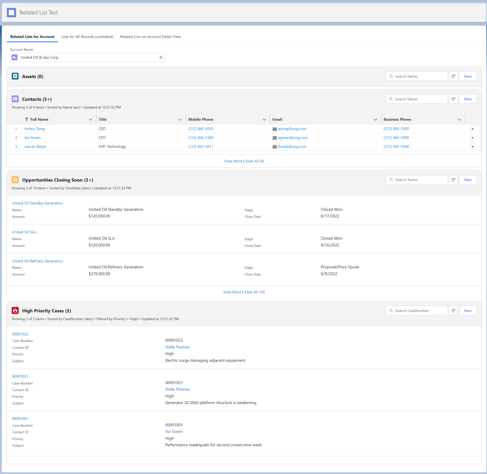
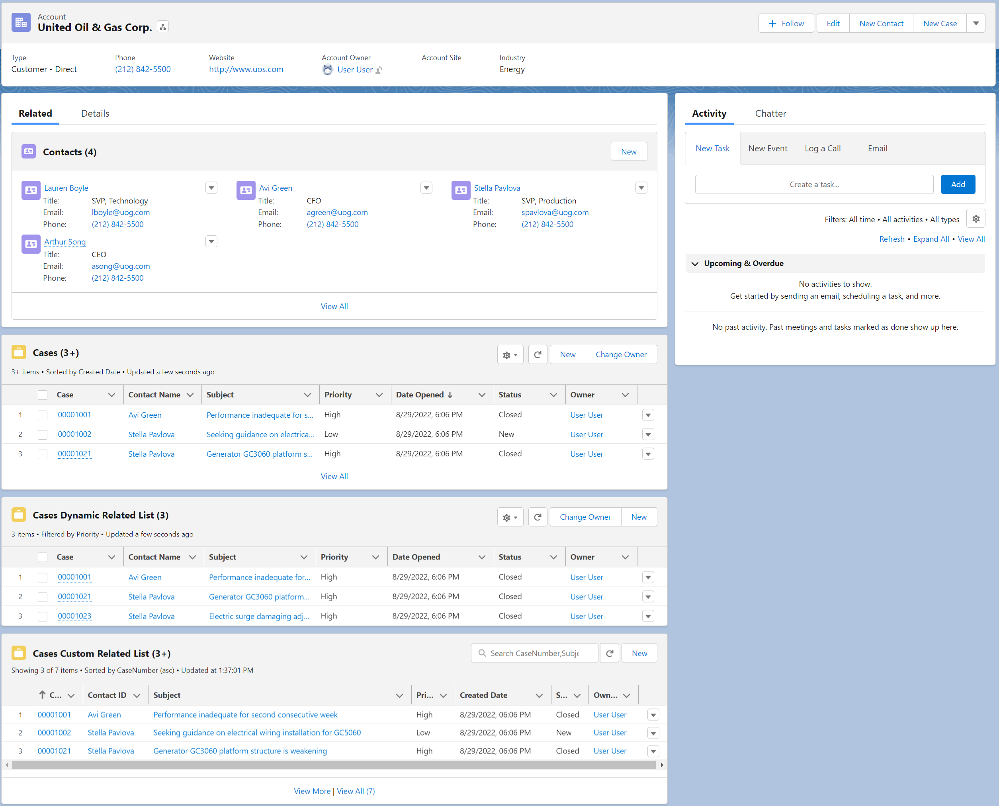
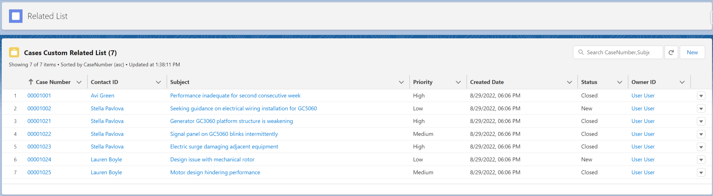

# Related List component based on LWC framework
Lightning component for displaying a list of Salesforce records that are related to a parent record with a lookup or master-detail relationship.

[Install the package](https://login.salesforce.com/packaging/installPackage.apexp?p0=04t0I000000XdMCQA0)

**Features:**

Similar functionality to standard and dynamic related list components, e.g. specify display fields with basic sort and filters, refresh and New buttons, edit/delete row actions.

With additional features/improvements:
- Ability to search list view and control exact (searchable text) fields to use, e.g. search Case Number and Subject fields, instead of searching all fields
- Use as a standalone list view, standalone related list to parent object, or as a related list on object detail page
- Configurable custom title and custom icon for related list header
- Status text for number of items/total items, filter applied, sort order, last updated datetime
- Specify related list display as table row view or as list of 1-2 column panel view
- Bottom of list provides "View more" and "View all" action links to view additional items
- No longer require column parameter to define data types, now dynamically looks up existing object field schema metadata

**Notes:**
- When click "New" button you need to fill in parent record in the pop up.
- View all records as paging limitation to prevent excessive query load times and/or hitting large query volume limits
- You can also check out [Related List based on Lightning framework](https://github.com/artyom-bazyk/singleRelatedList)
- Configurable parameters require some metadata knowledge such as object field api names, point-and-click custom property editors are not available

**Configuration:**

The component configuration fields are:
- **record-id** - Id of parent record for related list, leave empty for list of all (unrelated) records, e.g. similar to standard list view
- **sobject-api-name** - Name of child sobject (Required)
- **related-field-api-name** - Name of lookup or master-detail field on child sobject (Required if using record-id for related list)
- **sorted-by** - (API) Name of field used for sorting (Required)
- **sorted-direction** -  ASC or DESC for ascending/descending directions of sorting (Optional)
- **fields** - List of API Names for fields to display (Required)
- **columns** - Array of the columns object that's used to define the data types (Obsolete due to use of field schema metadata). For data types [read datatable specification](https://developer.salesforce.com/docs/component-library/bundle/lightning-datatable/documentation) 
- **custom-actions** - List of actions in action menu (Optional). Edit and Delete are default.
- **row-action-handler** - The action triggered when a row action is clicked. It overrides standard handler (Optional)
- **number-of-records** - number of records in a list. Default is 6 (Optional)
- **list-title** - Override related list header title instead of using default object name
- **list-icon-name** - Override related list header icon instead of using default object name
- **list-display-type** - - Specify related list display as table row view (List) or as list of 1-2 column panel view (Card1Col, Card2Col)
- **filter-field** - (API) Name of field for filtering
- **filter-operator** - Type of filter operator, e.g. "=", ">", "<" (SOQL syntax)
- **filter-value** - Value of filter to apply, e.g. High
- **filter-type** - Type of filter to handle filter value for SOQL syntax, e.g. "String" adds quotes around filter value, Boolean uses operatpr = with value true/false, and "Other" uses operator and value as is  
- **search-fields** - (API) Names of field to search (comma-separated)

**Screenshots:**

In Launcher go to "Related List App":

Related Lists for Account:

Lists for All Records (unrelated):

.png)

Related Lists on Account Detail View:

Related List View All:

